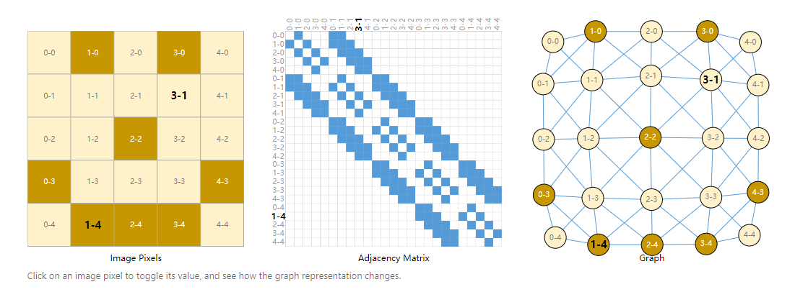

# Excicise 1

Simple framework for the cellular automaton in exercise 1.

## installation

Please note that our program needs ***python>=3.10.0***, and the requirements.txt file is a little bit different from the original one. Please rerun it.

```
pip install -r requirements.txt 
```

## Simulation

```
python main.py --json_path <path of a json file> --iter <# of steps> --distance_mode <dijkstra or euclidean> --r_max <r max param>
```

example:

```
python main.py --json_path ../scenarios/sc0.json --iter 100 --distance_mode dijkstra --r_max 2
```

# Json

An example:
Coordinates are form of (x, y).

```
{
    "shape": [200, 200],
    "targets": [
                    [50, 20],
                    [180, 60]
                ],
    "pedestrians": [
                    [[31, 2]    , 2.3],
                    [[0, 0]     , 1.8],
                    [[199,59]   , 2.1]
                ],
    "obstacles": [
                    [20, 10],
                    [21, 10]
                 ]
          
}
```

## Key idea

1. How to avoid obstacles?

   Build a undirected graph whose vertises represent grids, and those obstacles are removed from the graph. Use multi-target Dikjstra algorithm to calculate shortest paths for all vertises respectively. And use the result as cost function or pedestrian patential field. This figure shows details:

   
   Figure credit: [Sanchez-Lengeling, et al., &#34;A Gentle Introduction to Graph Neural Networks&#34;, Distill, 2021.](https://distill.pub/2021/gnn-intro/)
2. How to simulate individuals repulsive force?

   It seems trivial to for implementation the function: $ c(r) = e^{\frac{1}{r^2-r_{max}^2}} $. However, it would be extremely costly if we traverse all the other pedestrians for each pedestrian update step. Instead, according Newton's Third Law -- forces act mutually, we conduct a preprocess to compute repulsive force within a restricted area: $ \{(x,y) | (x-x_p)^2 + (y-y_p)^2 < r_{max}^2; x,y,x_p,y_p\in R\} $, where $(x_p, y_p)$ is the coordinate of a specific pedestrian. For discrete space implementation details, please look into our code.
3. When a pedestrian meet two same cost neighbour but one is in vertical/horizontal directions and the other is in diagonal directions, what should he do?

   Act as a greed algorithm, go vertically or horizontally.
