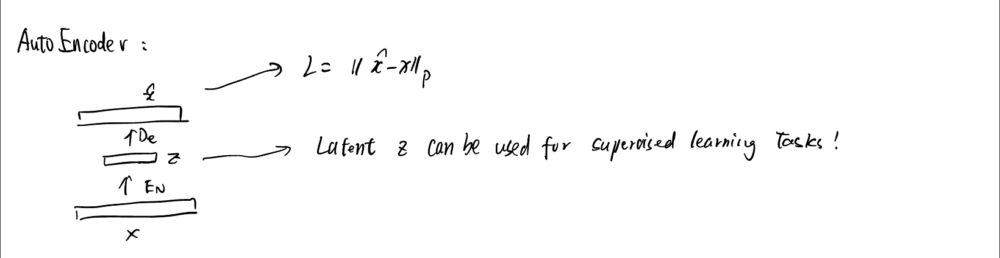
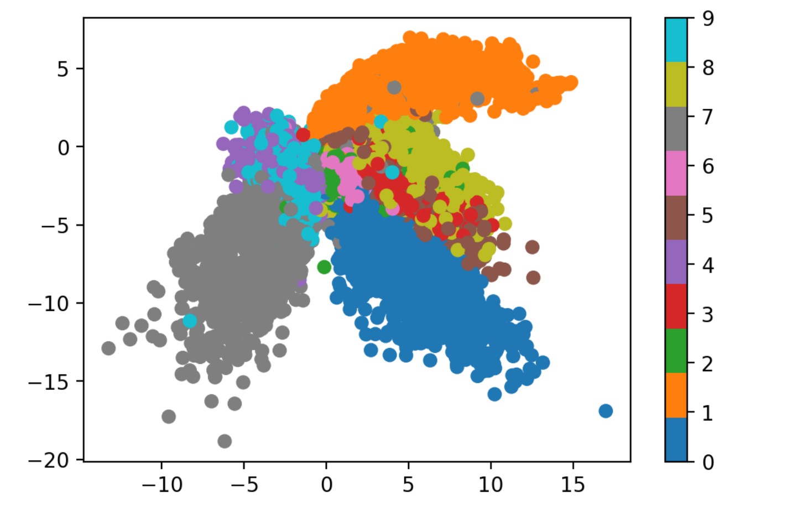
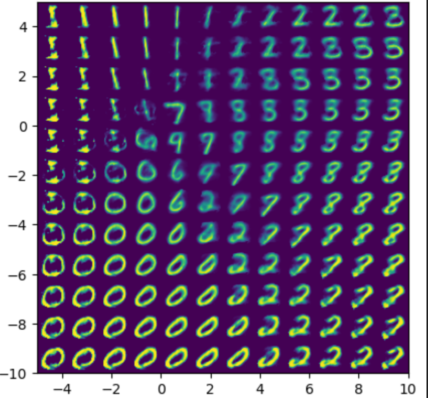
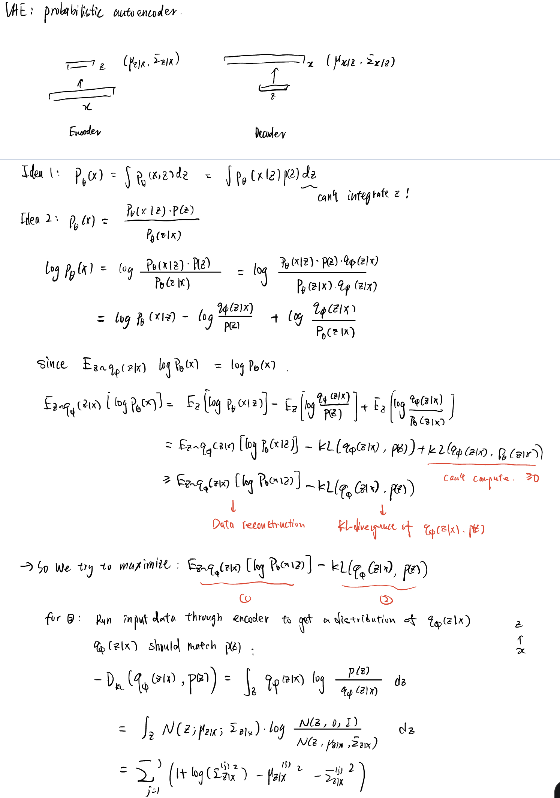
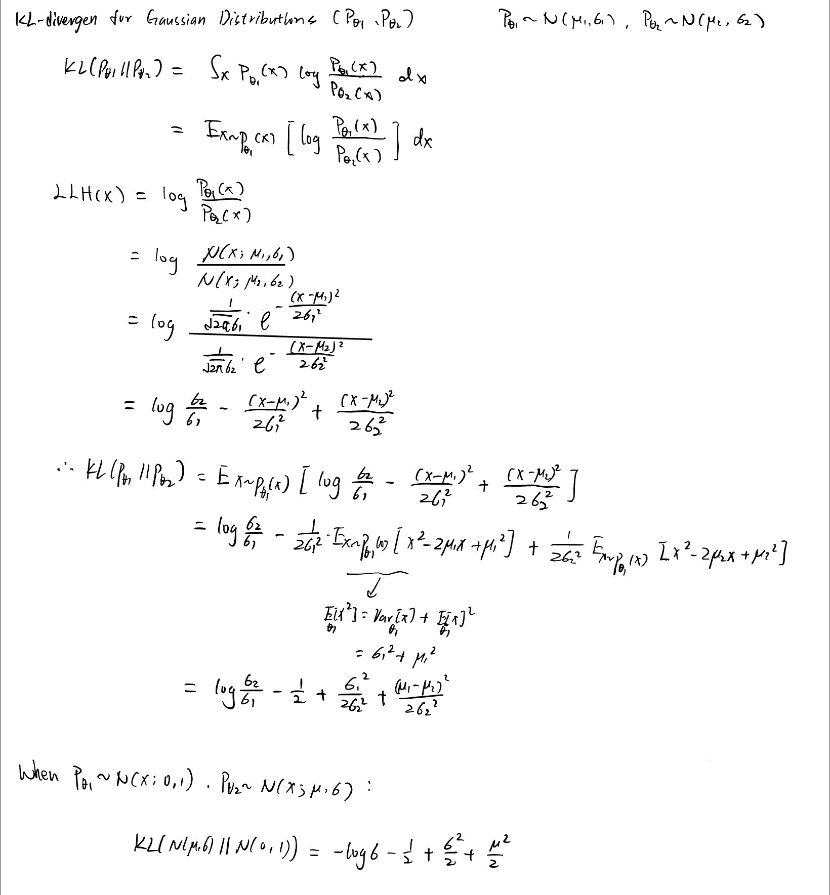
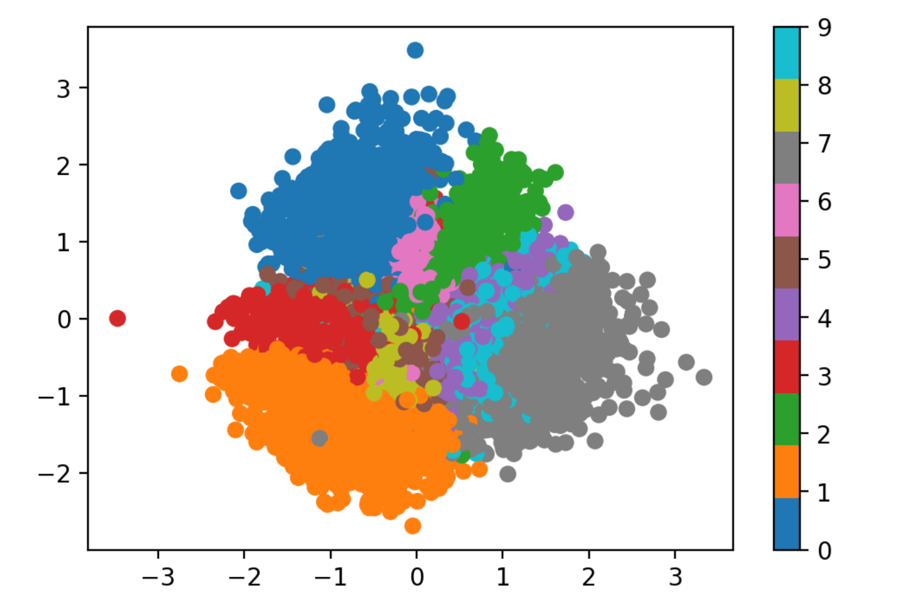
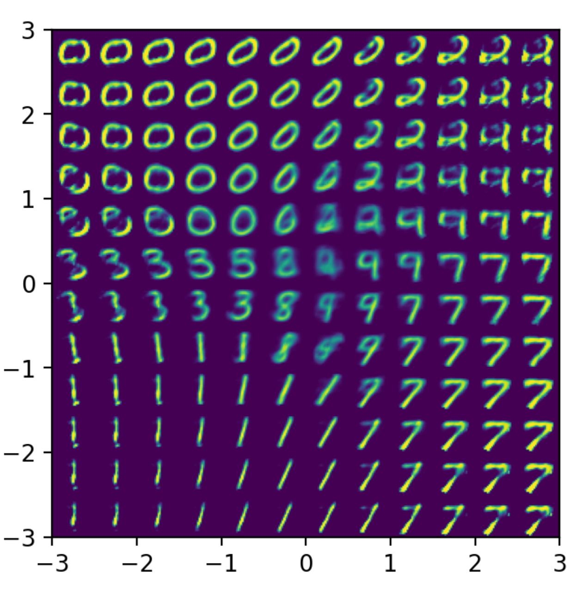
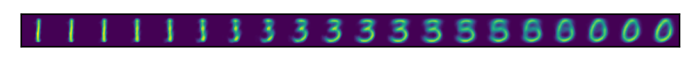

# Autoencoders
[VAE implementation](https://avandekleut.github.io/vae/)  
## (Regular, Non-Variational) Autoencoder

### Model
```python
class Encoder(nn.Module):
    def __init__(self, latent_dims):
        super(Encoder, self).__init__()
        self.linear1 = nn.Linear(784, 512)
        self.linear2 = nn.Linear(512, latent_dims)

    def forward(self, x):
        x = torch.flatten(x, start_dim=1)
        x = F.relu(self.linear1(x))
        return self.linear2(x)class Encoder(nn.Module):

class Decoder(nn.Module):
    def __init__(self, latent_dims):
        super(Decoder, self).__init__()
        self.linear1 = nn.Linear(latent_dims, 512)
        self.linear2 = nn.Linear(512, 784)

    def forward(self, z):
        z = F.relu(self.linear1(z))
        z = torch.sigmoid(self.linear2(z))
        return z.reshape((-1, 1, 28, 28))
class Autoencoder(nn.Module):
    def __init__(self, latent_dims):
        super(Autoencoder, self).__init__()
        self.encoder = Encoder(latent_dims)
        self.decoder = Decoder(latent_dims)

    def forward(self, x):
        z = self.encoder(x)
        return self.decoder(z)
```

### training loop
```python
def train(autoencoder, data, epochs=20):
    opt = torch.optim.Adam(autoencoder.parameters())
    for epoch in range(epochs):
        for x, y in tqdm(data, desc="Training"):
            x = x.to(device) # GPU
            opt.zero_grad()
            x_hat = autoencoder(x)
            loss = ((x - x_hat)**2).sum() # Loss
            loss.backward()
            opt.step()
    return autoencoder

latent_dims = 2
autoencoder = Autoencoder(latent_dims).to(device) # GPU

data = torch.utils.data.DataLoader(
        torchvision.datasets.MNIST('./data',
               transform=torchvision.transforms.ToTensor(),
               download=True),
        batch_size=128,
        shuffle=True)

autoencoder = train(autoencoder, data)
```
### Visualization
1. Latent $z$ disribution

2. P(x|z)

**notice! If we sample a latent vector from a region in the latent space that was never seen by the decoder during training, the output might not make any sense at all. We see this in the top left corner of the plot_reconstructed output, which is empty in the latent space, and the corresponding decoded digit does not match any existing digits.**
## Variational Autoencoder
### Model

$$ Z = \mu + \sigma \cdot I $$ 
, where $Z, I$ are diagonal Gaussian distributions. 
```python
class VariationalEncoder(nn.Module):
    def __init__(self, latent_dims):
        super(VariationalEncoder, self).__init__()
        self.linear1 = nn.Linear(784, 512)
        self.linear2 = nn.Linear(512, latent_dims)
        self.linear3 = nn.Linear(512, latent_dims)

        self.N = torch.distributions.Normal(0, 1)
        self.N.loc = self.N.loc.cuda() # hack to get sampling on the GPU
        self.N.scale = self.N.scale.cuda()
        self.kl = 0

    def forward(self, x):
        x = torch.flatten(x, start_dim=1)
        x = F.relu(self.linear1(x))
        mu =  self.linear2(x)
        sigma = torch.exp(self.linear3(x))
        z = mu + sigma*self.N.sample(mu.shape)
        self.kl = (sigma**2 + mu**2 - torch.log(sigma) - 1/2).sum()
        return z
class VariationalAutoencoder(nn.Module):
    def __init__(self, latent_dims):
        super(VariationalAutoencoder, self).__init__()
        self.encoder = VariationalEncoder(latent_dims)
        self.decoder = Decoder(latent_dims)

    def forward(self, x):
        z = self.encoder(x)
        return self.decoder(z)
```
### Loss Function
1. Minimization of KL divergence between $P_{\phi}(Z|X)$ and $N(0,1)$.
$$ \mathbb{KL}\left( \mathcal{N}(\mu, \sigma) \parallel \mathcal{N}(0, 1) \right) = \sum_{x \in X} \frac{1}{2}\left( \sigma^2 + \mu^2 - 2\log \sigma - 1 \right)\ $$
2. Optimize the output of the decoder just like the autoencoder.
$$ \|P_{data}(X)-P_{\theta}(X|Z) \|_2 $$
### Training loop
```python
def train(autoencoder, data, epochs=20):
    opt = torch.optim.Adam(autoencoder.parameters())
    for epoch in range(epochs):
        for x, y in tqdm(data, desc='training'):
            x = x.to(device) # GPU
            opt.zero_grad()
            x_hat = autoencoder(x)
            loss = ((x - x_hat)**2).sum() + autoencoder.encoder.kl
            loss.backward()
            opt.step()
    return autoencoder
vae = VariationalAutoencoder(latent_dims).to(device) # GPU
vae = train(vae, data)
```

### Mathsmatically Proof for VAE


### Mathsmatically Proof for KL-divergence between two Gaussian


### Visualization
1. Latent $z$ disribution

2. P(x|z)


### Interpolation
Lets see a visualization for decoding interpolations of different latent $Z$.


# Conclution
- In traditional autoencoders, inputs are mapped deterministically to a latent vector $Z=P_{\theta}(X)$.   

- In variational autoencoders, inputs are mapped to a probability distribution over latent vectors, and a latent vector is then sampled from that distribution. The decoder becomes more robust at decoding latent vectors as a result.