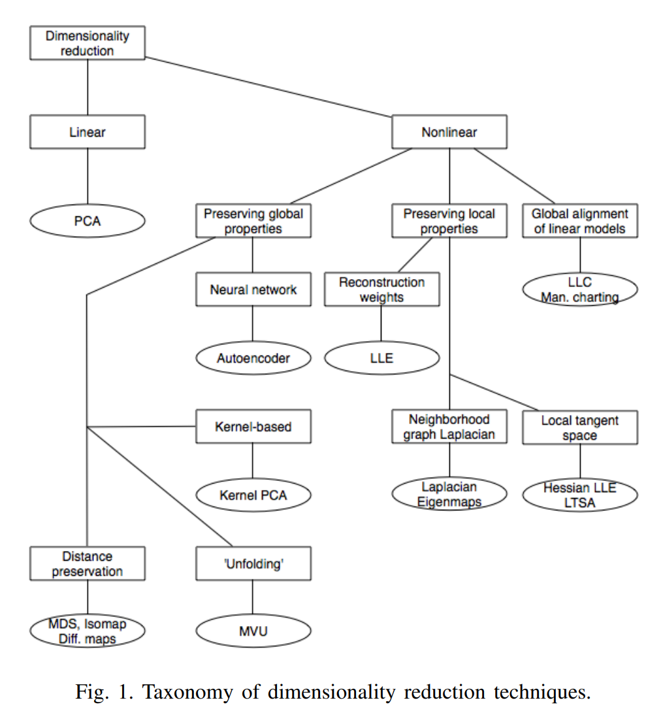

# Final Project
Final project of Group J in TUM MLCMS 2023S.

## Installation
```
torch
torchvision
scikit-learn
datafold
tqdm
gensim
matplotlib
numpy
seaborn
```


## Topic: Dimensionality Reduciton.
task:
1. what is dimensionality? why? motivation.
- better performance for ml alg: reduce the redundant info for model to learn a true boundary against overfitting. 
- fast training.
- visualization.

2. do some survey on popular methods: PCA, Isomap,, Diffusion Map, VAE...


3. codind and report.



## Paper for Reference
Notes from a Tsinghua DALAO: notes.pdf  
[An Introduction to Diffusion Maps](https://inside.mines.edu/~whereman/papers/delaPorte-Herbst-Hereman-vanderWalt-PRASA-2008.pdf) citation: 99 (2009)  
[A survey of dimensionality reduction techniques](https://arxiv.org/abs/1403.2877) citaion: 411  (2014)  
[A Review on Dimensionality Reduction Techniques](https://www.worldscientific.com/doi/abs/10.1142/S0218001419500174) citation: 99 (2019)  
[Analysis of Dimensionality Reduction Techniques on Big Data](https://ieeexplore.ieee.org/abstract/document/9036908) citation: 512 (2020)  
[Dimensionality Reduction: A Comparative Review](https://members.loria.fr/moberger/Enseignement/AVR/Exposes/TR_Dimensiereductie.pdf) citation: 1200+ (2009)  

## Blogs
https://aws.amazon.com/cn/blogs/china/characteristic-engineering-of-data-centric-ai-lecture-3/   

## difficulties
1. how to fairly compare the performance over data / dim-reducted data.
2. how to use word2vec (what corpus?)